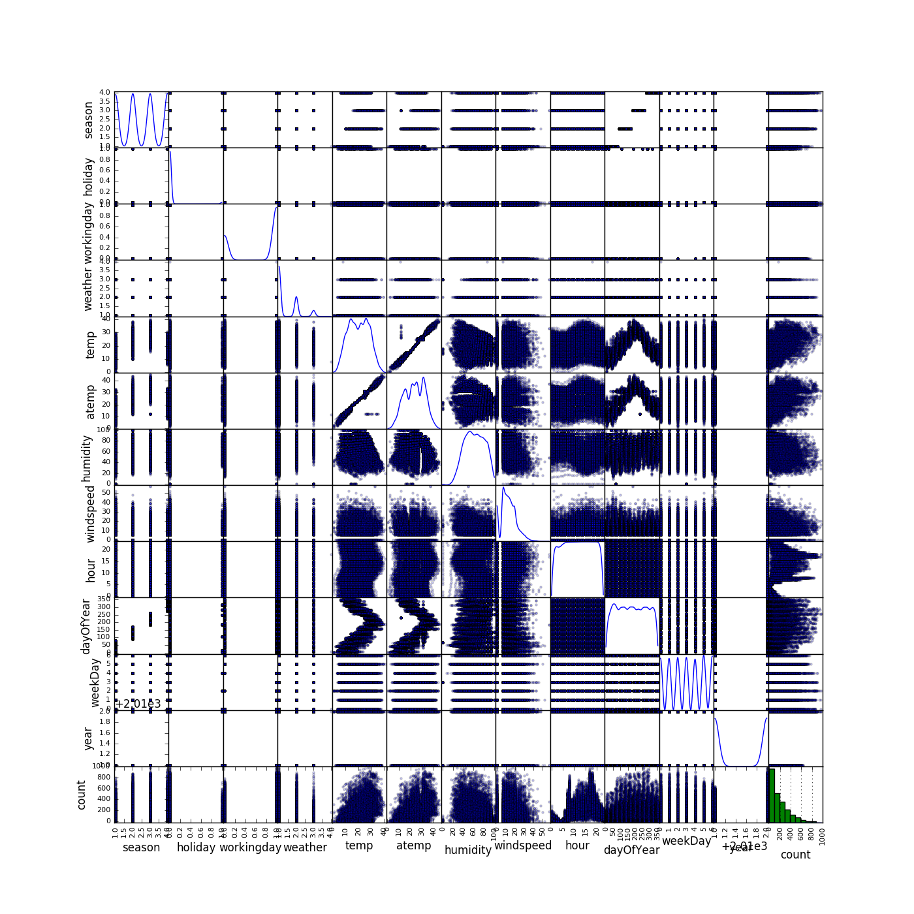

# Test techniques quantmetry

## Partie I – Statistiques descriptives

Tout d'abord il est important de modifier le jeu de données afin de pouvoir exploiter la colonne `datetime`. Celle-ci va être découplée en date ("yyyy/mm/dd") => `date`, heure => `hours` et jour de l'année => `dayOfYear`. Il n'y a que les 19 premiers jours pour chacun des mois. Ce n'est pas génant puisque c'est le cas pour chaque mois.

Le principal outil d'exploration de données sera la matrice de dispertion d'une variable en fonction d'une autre. Comme nous cherchons à prédire la variable `count` (dernière ligne, dernière collone), nous regardons ses dépendances. Nous désignerons un graphique de la matrice a partir des index (0, 0) désignant le graphique en haut à gauche.

- Les corrélations les plus évidentes avec `count` sont `hour` et `weather`.
- Les corrélations moins fortes mais significatives avec `count` sont `workingday`, `dayOfYear` et `holiday`.
- Les autres semblent avoir moins d'importance.

D'apres la courbe de Nous remarquons que la variable `count` semble suivre une equation de type exponentiel decroissante.

## Partie II – Machine Learning
