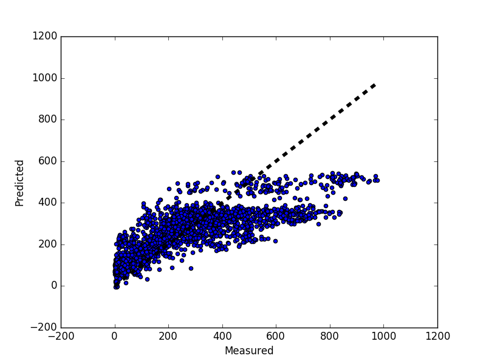
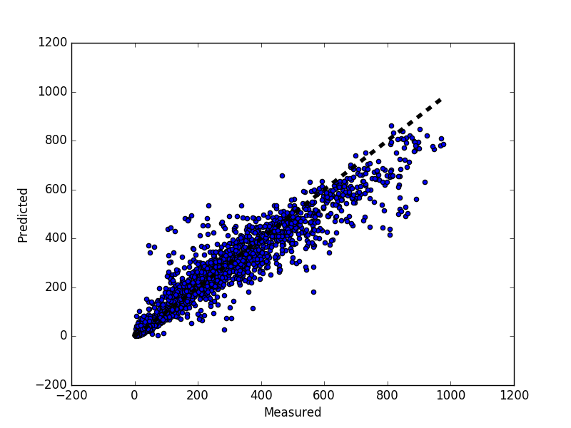

# [Kaggle bike sharing demand](https://www.kaggle.com/c/bike-sharing-demand)

## Part 1 - Exploratory data analysis

First, let's refactor the `datetime` feature. We can't analyse non numerical values. We transform it ("yyyy/mm/dd") into `date`, `hours`, `dayOfYear` and `year`.

The main data exploratory analysis tool is the scatter matrix of each feature against each other. Since we are trying to predict the `count` feature, we look at its relationship with other features.

- The most obvious features related to `count` are `hour` and `weather`.
- The least significant features related to `count` are : `workingday`, `dayOfYear` and `holiday`.
- The `count` variable seems to follow a decreasing exponential equation. Linear regression is probably not a good model.

According to first findings, it seems that casual and registered users do not rent bikes in the same way.

## Part 2 – Machine Learning
### Feature engineering
#### Categorical variables
Some of the provided features are categorical features : `weekDay`, `season` and `weather`. We are going to transform each categorical feature with m possible values into m binary features, with only one active.

#### Refactoring `datetime`
`datetime` is a string. This is a problem because strings cannot be processed mathematically. I transformed the string into a date and then extracted the features `hour`, `dayOfYear`, `weekDay` and `year`. Extraction of feature `year`, is what improved performance the most.

The `hour` feature was a particularly challenging problem. It can be considered a categorical feature on its own. There are few rentals at 1, 2, 3 am and at 10 and 11 pm => the relationship between the hour and the number of rentals is not linear. Firstly I split the `hour` feature, which is a number between 0 and 23, into 24 binary features. It worsened performance, probably because of overfitting. So I decided to cluster hours. For this I took the most simple clustering algorithm : k-mean. Empirically, I found that clustering `hour` in 12 chunks (of 2 hours), lead to the best performance. I then created one binary feature for each cluster.

#### `casual` vs `registered`
I mentionned in part 1 that casual and registered users follow different trends. Rather than trying to predict the overall number of rentals directly, I tried to predict individually the number of casual rentals, the number of registered rentals and then I summed them up. This improved performance a little bit (+100 places on the kaggle ladder).

### Model explanation
I benchmarked two models : one using linear regression and one using random forest. Random forest are, in essence, at least as efficient as linear regression, and offently far more, but at the cost of more time for fitting. In that particular case, since the `count` variable is not linear, linear regression performs poorly while random forest is more appropriate :

*linear regression results*

*random forest results*

Since the size of data is small, computational time is insignificant. I chose random forest.

### Performance criterions
#### Root Mean Squared Error (rmse)
This is a frequently used measure of the differences between values (sample and population values) predicted by a model and the values actually observed.

#### R squared (R2)
This an improved version of the rmse. This is a form of rmse which has been corrected by the variance of the value to predict. R2 corrects rmse, so that it only catch the difference between the predicted and the observed value caused by the model (and not the variation of the observed value).

### Improvement ideas
- cross validation : I tested my models by splitting my data into a train and a test set. To improve that test, it is better to implement a cross validation.
- test more algorithms : I only tested random forest and linear regression. Maybe other algorithms (neural networks...) would perform better.

## Conclusion

I ended up with a reasonably efficient model (I was ranked 749 out 3252). Since this was my first real world machine learning project, it was very enjoyable and I learned a lot at every steps (first time implementing R2, rmse, using random forest, doing real feature engineering...).
