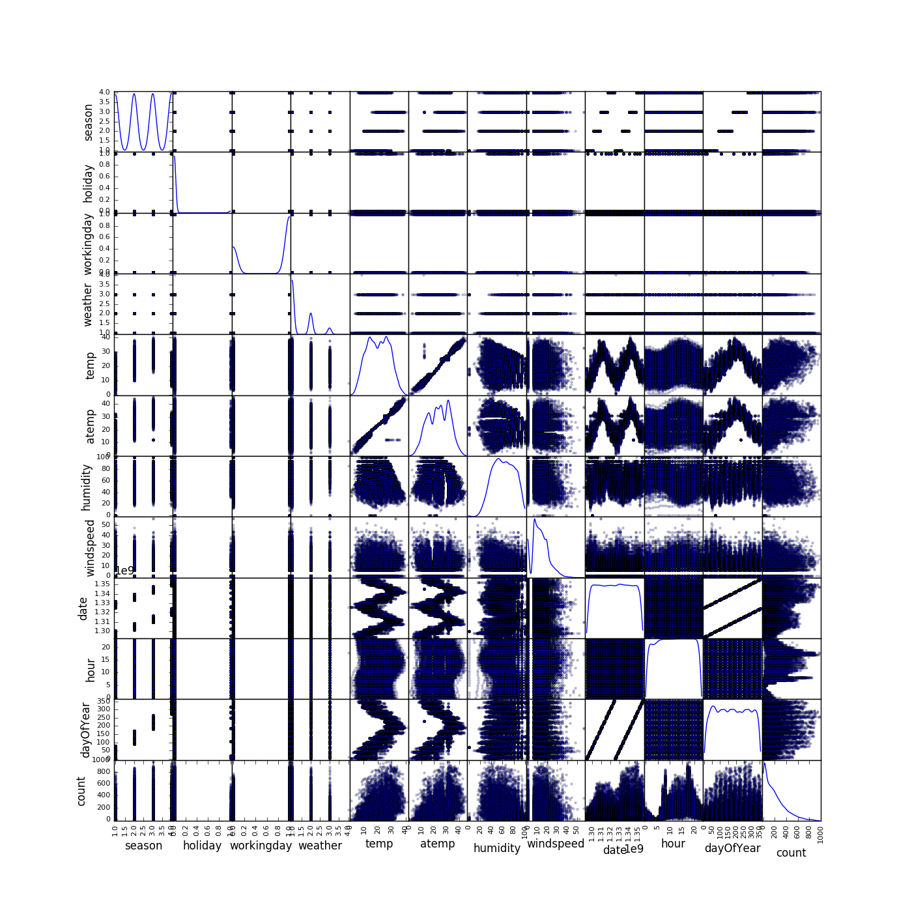
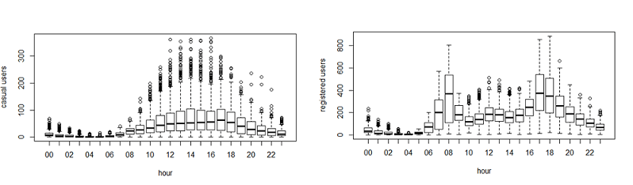

# [Kaggle bike sharing demand](https://www.kaggle.com/c/bike-sharing-demand)

## Part 1 - Exploratory data analysis

First let's refactor the `datetime` feature. We can't anlyse non numerical values. We transform it ("yyyy/mm/dd") to `date`, `hours`, `dayOfYear` and `year`.

The main data exploratory analysis tool is the matrix of repartition of a data against another. Since we are trying to predict the `count` feature, we look at its relations with other features.

- The most evident features related to `count` are `hour` and `weather`.
- Least significant linked features related to `count` are `workingday`, `dayOfYear` and `holiday`.
- The `count` variable seems to follow a decreasing exponential equation. Linear regression is probably not a good model.

It seems like casual and registered users rent bike following a different model.

## Part 2 – Machine Learning
### Feature engineering
#### Categorical variables

#### The importance of `year`

#### `casual` vs `registered`

### Model explanation
linear regression vs random forest

### Performance criterions
#### R squared

#### Root Mean Squared Error

### Improvement ideas
- cross validation
- test more models

## Conclusion
